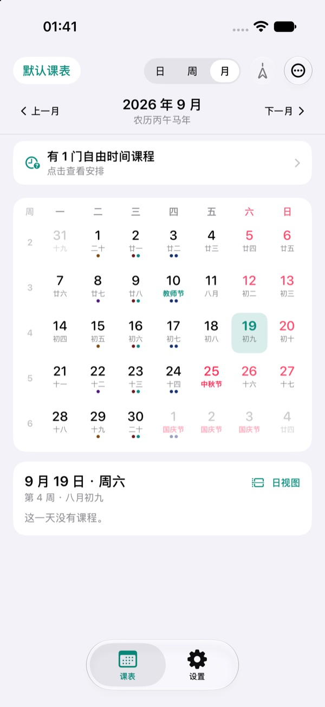

# NapTable（你以为课表）

NapTable 是一个原生 Apple 平台课表应用，面向 iOS、iPadOS、macOS 和 visionOS。它把课表、月历、农历节日、桌面小组件和实时活动放在同一套数据模型中，适合需要长期查看课程安排、处理调休并快速确认下一节课的场景。

## 主要能力

- 日、周、月三种课表视图，支持课程编辑、自由时间课程和 ICS 导出。
- 本地保存与离线渲染；课表可以通过文件导入或学校网页导入。
- 农历、传统节日、法定节假日和学校调休信息联动显示。
- iPhone / iPad 小组件：今日课程（小号、中号、锁屏看临近的课，大号看全天）和两日课表。
- iOS 实时活动与灵动岛，支持课间倒计时和可选的服务端 push-to-start。
- 可选服务端：学校学期配置、课表分享、时间配置快照和 APNs 推送调度。

## 界面预览

### 课表视图

| 周视图 | 日视图 | 月视图 |
| --- | --- | --- |
|  |  |  |

### 导入课表

### 实时活动

| 锁屏实时活动 | 灵动岛紧凑态 | 灵动岛展开态 |
| --- | --- | --- |
|  |  |  |

实时活动图片为 iPhone 18 Pro（iOS 27）模拟器中的系统截图，仅裁剪展示区域。截图环境和来源见[说明](docs/screenshots/README.md)。

### 小组件

| 临近课程小组件 | 两日课表小组件 |
| --- | --- |
|  |  |

## 文档

- [功能说明](docs/FEATURES.md)：课表视图、农历节日、调休、小组件、实时活动和分享行为。
- [开发与构建](docs/DEVELOPMENT.md)：项目结构、平台目标、App Group、构建和测试命令。
- [服务端部署与配置](server/README.md)：本地启动、网页管理、学校学期配置、分享 API 和 APNs 推送。
- [Live Activity v2](docs/live-activity-v2.md)：实时活动的客户端行为、HTTP 契约、调度与验收边界。
- [第三方声明](THIRD_PARTY_NOTICES.md)

## 快速开始

使用 Xcode 打开 `NapTable.xcodeproj`，选择 `NapTable` scheme 后运行。首次启动需同意基础隐私协议并成功导入课表；实时通知上传许可可先拒绝，后续开启实时通知时再授权。设置中可查看协议和撤回实时通知许可；小组件和实时活动需要在 iOS 真机或对应模拟器中测试。

最低部署版本和完整构建验证命令见[开发与构建](docs/DEVELOPMENT.md)。服务端不是运行 App 的必需项，只有学校配置、课表分享或服务端推送启动等功能需要它。

## 许可证

本项目自身的源代码以 GNU Affero General Public License v3.0 或更高版本（AGPL-3.0-or-later）发布，完整协议见 [LICENSE](LICENSE)。项目包含来自其他开源项目的移植或改编内容，适用范围和来源见 [THIRD_PARTY_NOTICES.md](THIRD_PARTY_NOTICES.md)。
