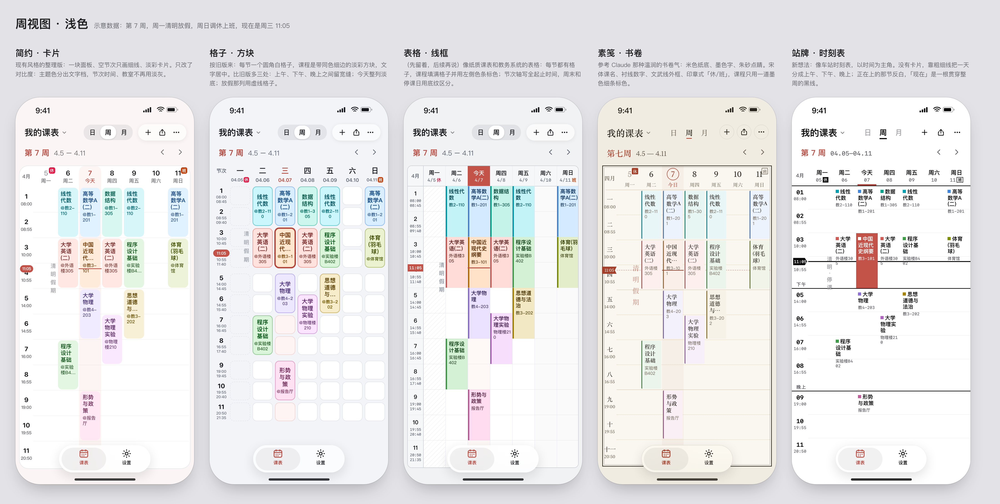

# 多主题功能与五套设计

整理日期：2026-10-06。本文记录本轮设计讨论与当前工作区的实现状态，作为后续开发和验收依据。

## 1. 功能目标与术语

让用户在同一份课表上切换五种视觉风格：**简约、格子、表格、素笺、站牌**。风格覆盖周、日、月视图，并逐步贯通分享图片、背景裁剪预览、小组件和实时活动。

| 概念 | 控制内容 | 示例 |
| --- | --- | --- |
| 视觉风格 | 布局、格线、卡片、字体、标记方式 | 简约、格子、表格、素笺、站牌 |
| 主题色 | 强调文字、选中状态、实心控件、淡底 | 兔兔粉、青绿、晴蓝、自定义 |
| 外观 | 浅色、深色或跟随系统 | 五套风格都需适配 |
| 课程配色 | 按课程分色或统一使用主题色 | 彩色课程、纯色课程 |
| 背景与密度 | 背景图片、主题底色、信息疏密 | 保留现有用户偏好 |

风格与主题色独立。换风格不修改课表数据、选中周次、课程时间、调休规则和编辑权限。五种风格的交互语义一致，允许信息组织方式有所不同。

用户已经要求先完成共享基础，再并行实现这些设计。此前“先三套、后站牌”的说法是建议顺序，不代表取消表格或缩减为三套。免费与付费的划分尚未决定。

## 2. 当前实现状态

以下以本次检查的工作区文件为准，包含未提交改动；不代表已发布。本次整理不重新宣称历史构建、测试结果有效。

| 能力 | 状态 | 依据与边界 |
| --- | --- | --- |
| 全局主题色与自定义颜色 | 已有实现 | `NativeThemeSettings`、`NextWidgetConfiguration`；持久化到 App Group，并刷新小组件与实时活动 |
| 主题色文字、填色、填色上文字、淡底 | 工作区已有实现 | `ThemePalette` 提供 `text` / `fill` / `onFill` / `tint`；App 根部注入主题色环境 |
| 课程配色 | 已有共享实现 | `WidgetCore/ScheduleCourseTint.swift` |
| 休/班角标、课程交互、静态分享模式 | 工作区已有实现 | `ScheduleAdjustmentBadge`、`ScheduleCourseInteraction`、`scheduleStaticRendering` |
| 五套视觉方案 | 已有网页示意稿 | 本文附图；不是五套 SwiftUI 实现 |
| 风格模型、风格选择与持久化 | 尚未完成 | 当前未发现 `ScheduleStyle` 或五套风格切换入口 |
| 所有视图、组件与扩展统一消费风格 | 尚未完成 | 现有共享代码是基础，仍需收拢并接入 |
| 固定数据、固定时间的完整截图矩阵 | 尚未完成 | 已有部分 Debug 界面入口，但不能据此视为完整矩阵 |

`ThemePalette` 位于 WidgetCore，具备共享条件；这不等于全部小组件和实时活动已接入新令牌。其对比度算法针对代码列出的画布、面板、今天列等背景，不能推广为任意背景图片上的可读性保证。

目前有 9 个预设主题色加自定义色，与五套风格是两个维度。小组件仍使用 `WidgetPalette`，实时活动仍使用 `ScheduleLiveActivityPalette`；App 的根级 `.tint` 也仍使用主题原色，这些都是后续接入时需要核对的边界。App 的背景染色和强制深浅外观设置不能直接视为控制所有小组件外观。

主要代码入口：

- [主题设置](../NapTable/Schedule/NativeThemeSettings.swift)、[共享配置](../WidgetCore/WidgetConfiguration.swift)、[主题色令牌](../WidgetCore/ThemePalette.swift)。
- [表面与语义颜色](../NapTable/Schedule/ScheduleGlass.swift)、[课程配色](../WidgetCore/ScheduleCourseTint.swift)。
- [课表主视图](../NapTable/Schedule/ScheduleSurfaceView.swift)、[课程与网格组件](../NapTable/Schedule/ScheduleGridViews.swift)、[月视图](../NapTable/Schedule/ScheduleMonthView.swift)。
- [分享图片](../NapTable/Schedule/ScheduleShareImage.swift)、[背景裁剪预览](../NapTable/Views/BackgroundCropEditor.swift)。

## 3. 五套设计对照

| 风格 | 核心视觉 | 周视图 | 日视图 | 月视图 |
| --- | --- | --- | --- | --- |
| 简约 · 卡片 | 淡彩卡片、单块面板、较少装饰 | 面板内行分隔线，卡片左上对齐 | 延续现有课程卡片和时间线 | 延续现有月历结构 |
| 格子 | 每节一个独立圆角格 | 白格子与带同色细边的淡彩课程块 | 一列宽格子，空节次保留 | 每天一个独立格子 |
| 表格 | 连续格线、色条、整齐对齐 | 课程填满单元格，左侧色条 | 节次、时间、课程、教室四列 | 格内写课程简称 |
| 素笺 · 书卷 | 米色纸底、墨色文字、朱砂标记 | 留白、墨线、书签与印章 | 延续纸页和书卷排版 | 中文年月、农历与纸页结构 |
| 站牌 · 时刻表 | 时间优先、等宽数字、强弱反差 | 上午/下午/晚上分段 | 正在上、接下来、已结束 | 延续时刻表视觉，细节待定 |

“格子”是用户指定的旧版圆角格子；“表格”是早期误解产生、随后保留下来的独立候选，两者不能合并。

### 3.1 简约 · 卡片

定位：当前界面的连续演进，也是旧用户升级后的默认风格。

- 周视图使用一块面板与行分隔线；空节次不另画白格子。课程卡片左上对齐，圆角 9，不加同色细边。
- 日视图保留用户在 `aca066ec` 中主动加入的白色高光边、投影和教室前的 `@`。这些是已确认选择，不当作需要回退的问题。
- 今天以主题色文字和整列淡底标识；日、月视图沿用当前信息结构。
- 优化重点是语义颜色、文字可读性、组件一致性，而不是重做现有布局。
- 深色下注意今天列底色与半透明课程块的叠加，最终以实际渲染为准，不能仅凭颜色推算断言显示异常。

收益是改动少、用户熟悉；代价是与其他方案相比，整周空闲时段和月度课程分布没有那么突出。

### 3.2 格子

定位：恢复用户截图中的旧版格子语言，并形成可切换风格。

- 每一节是独立圆角白格子；课程为淡彩方块，加 1.5pt 同色细边，文字居中，教室前带 `@`。
- 周表头上方写“一 二 三”，下方写日期；节次轴显示节号与起止时间。
- 上午、下午、晚上之间额外留约 8pt 间距；具体分段需适配学校作息，不能把示例节数硬编码为业务规则。
- 今天列的空格子铺淡主题色；假期列在示意稿中用虚线框和竖排假期名称区分普通空课日。
- “现在”线从课程块下方经过，在空格子处可见；当前课程额外描主题色边。
- 日视图保留空节次，课程格右侧显示状态；月视图每天一个格子，今天描主题色边，假期铺淡红底。
- 深色版本保留格子边界和课程层级，不能简单把浅色白格子原样压暗。

顶部继续使用单行周次和日期范围，不恢复旧版三块大按钮与粉紫渐变。假期虚线、额外分段间距等属于新版示意稿的优化提案，不是旧版必须复刻的细节。

收益是空闲时段直观、接近用户认可的旧设计；代价是格子多时视觉较密，需要控制边框和间距。

### 3.3 表格

定位：更强调课表作为表格的扫描效率。

- 周视图画完整连续格线，课程填满单元格，以左侧约 3pt 色条标识课程颜色。
- 节次轴显示完整起止时间；周末列铺浅灰底，假期列用斜线底纹。
- 今天表头整格反白；“休/班”写在日期后，不叠压星期。
- 日视图按“节｜时间｜课程｜教室”排列，空节次显示“—”。
- 月视图格内展示课程简称，让整月安排能被直接扫描；简称生成、溢出数量和截断规则需要实现时确定。
- 深色版保持清楚的行列关系，降低大片边框的亮度，正文仍需足够对比度。

收益是信息密度高、便于找空闲时间；代价是小屏容易拥挤，需要处理长课名、课程冲突和大字号。

### 3.4 素笺 · 书卷

定位：参考古典书页的安静阅读感。

- 浅色基准为米色纸底 `#F1ECE2`、墨色 `#2A251F`、朱砂 `#A63F29`；这些是示意稿色值，不是所有背景组合的最终令牌。
- 课程以细色条区分，衬一层很淡的同色底，正文保持墨色；不使用饱和的彩色块。
- 示意稿课名采用宋体，数字采用 New York；外框为外粗内细的文武线。
- 节次轴写“一 二 三”，今天写“今日”并画朱砂圈，整列铺很淡的朱砂底，“现在”采用书签标签；“休”为实心印章，“班”为空心印章。
- 日视图延续纸页排版，可以展示节气、农历信息；月视图用中文年月与农历，不应直接复用示例中的固定日期文案。
- 深色版需重新定义纸底与墨色层级，保留朱砂语义，不能机械反色。

字体交付方案未定：可以先用系统中文字体配衬线数字，也可评估可下载字体或内置字体。网页在当前电脑上能显示宋体，不代表 iOS 和小组件必然可用；需验证可用性、授权、包体和字体缺失时的回退。

收益是辨识度高、阅读平静；代价是字体适配和较多排版调整。主题色可降低饱和度融入纸墨配色，但需明确它与固定朱砂状态色的职责。

### 3.5 站牌 · 时刻表

定位：突出“现在上什么、下一节在哪里、还有多久”。

- 不以圆角卡片为主要容器，数字使用等宽字体；以粗线分开上午、下午、晚上。
- 周视图当前课程反白，贯穿课表的线标记现在；线与文字的层叠需通过实图检查。
- 日视图顶部以大块反白区域写正在上的课程和时间，接着显示“接下来”，已结束课程收在下方。
- 月视图已有概念示意，但月内状态、课程摘要和点击后的信息层级尚未形成独立规格，需补齐。
- 深色可采用琥珀色夜间站牌方案；这是可选方向，尚未作为固定配色决定。

收益是临近课程一眼可见，也便于向锁屏和灵动岛延展；代价是与现有日视图结构差异最大，需要特别处理无课、课间、一天结束与跨日状态。

## 4. 已有示意图与源文件

图像均为本轮讨论中的 HTML/CSS 模拟，**不是 SwiftUI 截图，也不是实现完成的证据**。示例数据为第 7 周、2027 年 4 月 5–11 日、周三 11:05，包含假期与调休；这些仅用于对比设计，不代表官方放假安排。

| 预览 | 内容 |
| --- | --- |
| [周视图 · 浅色](design/schedule-styles/previews/week-light.png) | 五套并排 |
| [周视图 · 深色](design/schedule-styles/previews/week-dark.png) | 五套并排 |
| [日视图 · 浅色](design/schedule-styles/previews/day-light.png) | 五套并排 |
| [月视图 · 浅色](design/schedule-styles/previews/month-light.png) | 五套并排 |
| [格子专题](design/schedule-styles/previews/grid-set.png) | 周视图浅/深色、日视图、月视图 |

源文件：[index.html](design/schedule-styles/mockups/index.html)、[dayMonth.js](design/schedule-styles/mockups/dayMonth.js)。在浏览器打开 HTML，分别使用 `#week-light`、`#week-dark`、`#day-light`、`#month-light`、`#grid-set` 查看。源文件按原样归档，含 macOS 本地系统字体路径；其他环境可能回退字体，因此以 PNG 作为本轮讨论的视觉存档。

尚缺完整的日视图深色、月视图深色和各设备规格的真实截图。之前对比度数字属于特定示意图或颜色计算结果，不能作为五套最终界面均已达标的结论。

## 5. 共享基础与技术方案

本节为后续实现约定；除第 2 节注明部分外，不应读作现有 API。

### 5.1 风格描述与令牌

建议新增稳定的风格标识 `ScheduleStyle`，五个值分别对应简约、格子、表格、素笺、站牌。持久化标识不使用中文展示名称，旧安装及无法识别的值回退到简约。

每套风格由视觉令牌与结构配置描述：

| 类型 | 配置内容 |
| --- | --- |
| 颜色 | 画布、面板、主次文字、分隔线、课程填色与描边、选中态 |
| 字体 | 课名、元信息、时间数字、日期与节次 |
| 几何 | 圆角、间距、内边距、线宽、分段间距 |
| 网格 | 无格线、横线、完整格线、独立圆角格 |
| 课程呈现 | 内缩卡片、填满单元格、色条文字；对齐与边框 |
| 日期与状态 | 今天、选中日期、休/班、现在、正在上/下一节/已结束 |
| 控件表面 | 系统玻璃或平面处理，以及旧系统回退 |

通用视图优先消费语义配置，避免散布 `if style == …`。表格四列布局和站牌分组这类结构差异允许使用专门布局组件，避免堆叠大量布尔开关。

共享的风格定义、颜色和纯计算逻辑放入 WidgetCore；App 专用布局和交互留在 App。小组件和实时活动共享视觉语义，按照容器空间适配，不照搬整张课表。

### 5.2 组件收拢

统一课程内容、日期标记、休/班角标、现在指示、节次轴和选中态。周/日/月视图、分享图和裁剪预览消费相同规则。设置里的缩略预览使用真实组件和固定示例数据。

主题色沿用现有 `text`、`fill`、`onFill`、`tint` 分档。课程颜色单独处理，不能把课程分色直接替换为全局主题色。更换纸底、深色底或背景遮罩后，应重新验证组合对比度。

### 5.3 设置、持久化与迁移

- 增加风格选择入口，使用五张缩略预览，选中后立即生效；主题色保持独立选择。
- 共享偏好通过 App Group 供扩展读取，切换时刷新小组件及相关实时活动显示。
- 升级默认保留简约，以及用户当前主题色、课程配色、背景和密度。
- 是否跨设备同步风格、是否允许小组件单独选风格，尚待决定；数据字段与迁移需同步考虑。
- 专业版卡片外观仍待讨论，本功能文档不代表批准修改该卡片；各风格的收费归属也未定。

### 5.4 背景、系统与无障碍

- 保留背景图，按不同风格调节表面与遮罩；若纸墨风格或高密度表格需要限制透明度，应在预览中如实显示。
- 不在整张课表的几十个格子上分别堆叠实时模糊；系统控件沿用系统行为，风格调整色调和周围排版。
- 尊重增强对比度、减少透明度、减少动态效果和动态字号。高对比优先作为每套风格的适配档，不另算第六套风格。
- 所有风格保留轻点速览、长按编辑、空节次添加、只读权限和读屏操作；不能只靠颜色区分状态。
- 实时活动能力分组遵守项目命名：“iOS 18：远程启动”“iOS 26 及以上：本地预约”；外观重构不修改 API 可用性判断。

## 6. 实施顺序与并行边界

1. **完成基础**：核对并收尾颜色令牌接入；建立固定数据、固定时间的 Debug 演示和隔离模拟器截图流程。
2. **提取简约**：定义风格模型与语义组件，把当前样式迁入；使用前后截图确认没有意外视觉变化。
3. **并行做其余四套**：接口稳定后，各子代理分别负责一种风格的令牌与专用布局。共用设置、存储、组件接口由集成者维护，避免并行改同一主视图。
4. **完整接入**：添加选择入口，贯通周/日/月、分享、裁剪预览、小组件与实时活动，明确各端支持范围。
5. **验收**：合并后统一构建与截图审查，完成下方矩阵，再更新本文状态表。

## 7. 验收要求

基础截图集至少为 **5 风格 × 2 外观 × 3 视图 = 30 张**，使用相同的固定数据和时间。不能用网页示意图代替真实 App 验收。

扩展覆盖三档密度、小屏与大屏、大字号、有无背景图、预设与极端自定义主题色；重点检查长课名、长教室名、冲突课程、跨节课程、空课日、假期、调休和相邻月份。

- 切换与重启后风格正确；旧数据与未知风格值安全回退，课程数据不变。
- 今天与选中日期可分辨，当前/下一节/已结束状态准确；月视图展示与所选日期一致。
- 普通正文以 4.5:1 作为目标对比度；带图背景按实际合成结果测量，另验证增强对比度与读屏。
- 分享图沿用所选风格但使用静态状态，不携带今天、现在、已结束等随时间变化的标记。
- 裁剪预览与实际课表一致；所有承诺支持的扩展同步更新。
- 真机或模拟器核查点击、长按、滚动和转场；记录无法实测的项目，不仅靠代码推断视觉问题。

## 8. 尚待收敛的设计

| 事项 | 当前边界 |
| --- | --- |
| 素笺字体与深色纸墨配色 | 有方向，最终字体方案与令牌待定 |
| 站牌月视图和深色琥珀方案 | 有示意，完整交互与状态规格待补 |
| 月历相邻月份的休/班角标、周末标题 | 是否弱化或独立着色待定 |
| 速览进入编辑后取消的返回路径 | 当前可关闭；是否返回速览待定 |
| 背景图在各风格中的融合 | 需要实际截图决定遮罩和透明度 |
| 免费/专业版分配、跨设备与扩展独立设置 | 产品决策未定，不在本次整理中擅自确定 |

“通透”和“手账”保留为未来想法，不属于本轮五套；本轮也不借多主题功能改动订阅、隐私授权或课表业务规则。
