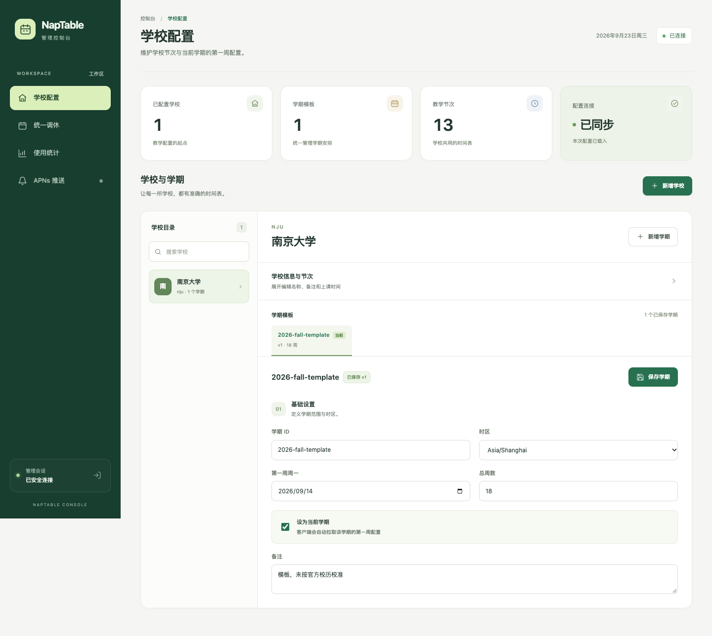
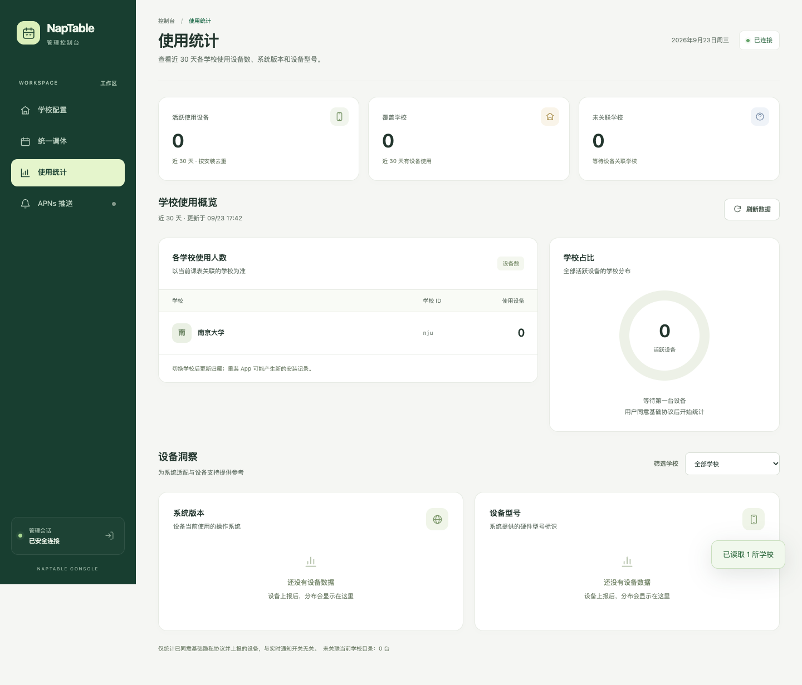

# NapTable 服务端

## 图片课表导入

课表名称不从图片读取，也不交给模型生成；App 统一按学期日期使用「2026 秋」这类名称（7 月起为秋季，之前为春季）。未读到学期日期时先按当前日期命名，用户补填日期后自动名称同步更新；手动改过的名称会保留。已有同名课表时自动追加「（2）」等序号。每门课程的名称仍正常识别。

客户端「其他学校 / 图片导入」提供手动导入和图片导入。所有识别字段都允许缺失：读取到的信息先进入可编辑向导，用户可以修改；未读到的信息由用户补填。没有读到的学期、总周数和节次时间会使用临时默认值并明确提示核对。课程名称、星期、起止节次和周次缺失时保留为待填写，不会把未知周次当作全学期，也不因信息不全丢掉课程；没有识别到课程时仍可进入向导手动添加。最终创建课表前须补齐课程排课所需的信息，教师和教室可留空。

识别提示词会先对齐星期表头和节次行标，再按单元格覆盖范围提取课程；只有像素位置而没有标注时不猜节次。课程记录以独立上课安排为单位：先结合版面、语义和时间关系判断边界，再提取属性；同一安排的多行、多值描述保留在对应字段，不能仅因换行或属性增多而拆条，明确不同的排课仍分别保留。为减少模型输出 token，默认提示词要求输出紧凑 JSON；课程名称、教师、教室、星期和起止节次相同且课程名、星期、节次、周次明确时，合并周次为去重升序列表，重复展示的同一课程块只提取一次。不同时间、教师或地点的安排分别保留，未知周次不与已知周次合并，不因同名而丢失安排。上游模型不再输出 `warnings`，服务端为 App 补回空数组。图片中的全天节数、作息表和明确的作息规则会一起读取。响应新增可空的 `periodCount` 和 `periodTimes: [{period, start, end}]`：部分可读时间保留实际节次编号，未知端点为 `null`；完整时间表仍通过原有 `classTimes` 返回。新客户端兼容没有新增字段的旧响应，部分时间缺失时只暂填缺失项；暂填作息与已识别时间冲突时保留课程，修正后才能继续。

为减少实际输出 token，上游使用短键 JSON：顶层 `s/w/p/t/pt/c` 对应学期开始、总周数、总节数、完整作息、部分作息、课程；课程按名称和教师分组：`n/t/a` 对应名称、教师、上课安排列表，每个安排的 `r/d/s/e/w` 对应教室、星期、起止节次、周次。同一课程的名称和教师只输出一次，不同教师分别分组；无可读安排时 `a=[]` 仍保留课程。服务端兼容上一版平铺短键，展开后总安排数仍限制为 200 条。时间使用 `s/e`，部分作息另加 `p`。周次输出字符串，如 `1-16`、`1-15/2`（步长 2）、`1-4,7,9-15/2`；未知为空串。服务端展开短键与周次后执行原有校验，App 返回格式不变，也兼容旧模型响应。固定输出协议附在管理员提示词之后，自定义提示词无需手动改字段名；请勿在自定义内容中强制旧输出格式。实际节省比例取决于课表和模型，思考 token 仍受思考强度影响。

默认关闭图片导入。在管理后台「图片导入」页填写 API 密钥、完整 HTTPS Responses 地址和支持图片输入、严格 JSON Schema 输出的模型，再打开功能开关。密钥保存在服务端数据库中，管理接口只返回“已配置”状态，不会返回密钥；也可以在 `/etc/naptable/naptable.env` 设置 `NAPTABLE_IMAGE_IMPORT_API_KEY` 作为环境变量回退（本地启动则使用同名环境变量）。地址默认 `https://api.openai.com/v1/responses`，模型必须明确填写；可以配置兼容 Responses 协议的其他服务。

后台「思考强度」可选模型默认（空串）、`none`、`minimal`、`low`、`medium`、`high`、`xhigh`、`max`，保存后下次识别生效。原先未设置思考强度，升级后仍默认不传该参数，由上游决定；显式选择时通过 Responses 的 `reasoning.effort` 发送。想加快识别可先尝试 `low`，各模型和兼容服务支持的档位不同，参见 [OpenAI 官方思考强度说明](https://developers.openai.com/api/docs/guides/reasoning#reasoning-effort)。旧后台省略 `reasoningEffort` 时保留已有配置；公共接口不暴露此项。

允许模型返回独立的思考内容：原生 Responses 的 `reasoning` 项、兼容服务的 `analysis` / `reasoning` 消息通道以及思考内容块均与最终课表分开处理。兼容服务若把思考放在正文前，支持剥离完整的 `<think>…</think>`、`<thinking>…</thinking>` 或 `<analysis>…</analysis>` 前缀，再读取最终 JSON（也支持 JSON 代码块）。仅解析完整的最终答案，不从思考中的 JSON 草稿抽取课程；只有思考、标签未闭合、输出被截断或拒绝识别时仍会报错。思考内容不返回给 App，也不写入数据库或日志。最终结果仍使用严格 JSON Schema 和原有字段校验；思考内容占用模型输出额度，额度不足时提示调整最大输出 token 或思考强度。

后台同页可编辑「课表识别提示词」，首次展示服务端内置的 `DEFAULT_PROMPT`，自定义内容最多 12000 字符，保存在服务端数据库。点击「保存配置」后，下一次识别直接使用新提示词，无需重启服务或更新 App。「恢复默认提示词」会把编辑框恢复为内置内容，再保存后生效；留空保存也会恢复默认。使用默认时数据库只存空字符串，因此后续服务升级可自动采用新版默认提示词；自定义内容不会被升级覆盖。旧后台未提交 `prompt` 时保留已有配置。管理接口的 `config.prompt` 返回自定义内容（空串表示默认），`defaultPrompt` 返回内置全文，`promptMaxLength` 返回长度限制；公共接口不返回提示词。后台同时列出可识别字段，调整提示词后返回的 JSON 仍须通过固定结构和字段校验。

默认要求 App Attest 设备验证。App ID 沿用后台 APNs 的 Team ID 和 Bundle ID，需先配置；有效 App Attest 请求按设备和全站额度计算，不共享校园统一出口的 IP 额度。模拟器联调或关闭设备验证时，才按地址哈希执行每 IP 每小时 30 次的回退额度。默认每设备每日 5 次、全站每日 300 次；每日按 UTC+8 重置。额度在上游调用前持久化预占，失败、超时、无效输出及进程中断都计入额度，重启不会重置。图片识别最多并发 2 次；未验证请求另有每 IP 每小时 120 次的内存入口限制。Nginx 对所有图片请求只保留宽松的每秒 30 次、突发 120 次边缘保护，避免校园统一出口误伤正常设备；接口超时默认 60 秒，可调至 90 秒，客户端不自动重试。

客户端先缩图并转成去元数据的 JPEG；服务端仅接受 base64 静态 JPEG/PNG/WebP，不接受远程图片 URL 或客户端提交的提示词。图片最多 3 MB、2000 万像素；上游图片最长边限制为 2400。使用 [OpenAI 官方图片输入格式](https://developers.openai.com/api/docs/guides/images-vision)及[结构化输出格式](https://developers.openai.com/api/docs/guides/structured-outputs)，识别提示词由管理员配置（未配置时使用内置默认），无工具调用，并设置 `store=false`。返回值再次验证星期、节次、周次、日期、时间和字段长度。我们的数据库不保存图片及课程，只保留匿名调用时间、设备/IP 哈希、结果、模型、课程条数、耗时、输入/输出 token 与脱敏错误摘要 90 天，在后续调用或统计查询时清理；后台展示近 30 天统计。AI 服务的数据保留规则由提供方决定，`store=false` 不代表第三方完全不保留数据。

接口：`GET /v1/import/image/config` 返回公开功能状态；`POST /v1/import/image` 接收 `{ "imageBase64": "..." }` 并返回识别结果；管理员 `GET/POST /v1/admin/image-import` 读取统计或保存配置，沿用管理员认证及审计。关闭/未配置时返回 503，需要设备验证时返回 403，额度或并发超限返回 429，上游失败或输出无效返回 502。部署的 nginx 对图片上传单独允许 5 MB 请求和 100 秒等待，其余接口保留原限制。

502 的 `error` 会区分上游 HTTP 状态（密钥、权限、模型、限流等）、连接/处理超时、输出截断、拒绝处理、空输出、JSON 格式及具体字段校验失败。上游 HTTP 错误还会显示经脱敏和限长的 `message`、`param`、`code`，便于定位具体被拒绝的参数；最多读取 16 KiB JSON 错误响应，非 JSON 或超限时保留通用分类。不转发完整响应正文、密钥或图片编码。输出达到长度上限时可在后台调整「最大输出 token」；响应状态处理遵循 [OpenAI Docs 结构化输出边界情况](https://developers.openai.com/api/docs/guides/structured-outputs?api-mode=responses)。模型返回空课程时，客户端仍允许在编辑向导中手动补填。客户端不展示模型 warnings 或逐条缺失信息 warning，保留通用核对说明和创建课表所需的字段校验。兼容服务的纯 `output_text` 和包裹 JSON 的代码块也会在去除包装后经过同样校验，不接受未完成的响应。模型结构中的键保留以适配严格输出：未读到的标量为 `null`，列表为 `[]`。列表使用普通 `type: "array"`，避免 `type: ["array", "null"]` 在兼容服务触发 `unknown variant "array"`；服务端仍兼容返回 `null` 列表或省略字段的对象。

后台「图片导入 → 最近识别错误」展示近 30 天最新 50 条错误，包括时间、模型、结果分类、客户端/上游 HTTP 状态与脱敏错误摘要。客户端报错带有相同的记录编号，接口也返回 `errorID`。这些摘要与调用记录一起在数据库保留 90 天，不保存图片、课程、原始请求体或完整上游响应。启动时自动为旧数据库补齐错误字段，无需手动迁移。错误同时以 `image_import_error event=…` 写入标准错误日志；systemd 部署可用 `journalctl -u naptable -f` 查看，运行日志的轮转与保留期由服务器日志配置控制。

验证：`uv run --frozen python -m unittest tests.test_image_import` 使用模拟上游，不发送真实模型请求；`bash tests/check-manual-schedule.sh` 校验识别结果映射和大小课间生成。真实课表识别效果需配置密钥后实测。

服务端把配置拆成三个明确层级：每所学校的节次时间只配置一次；每个学期只保存第一周周一、总周数和“当前学期”标记；统一放假和统一调休日期集中维护，再由学校分别选择是否启用。App 启动和回到前台时会自动拉取学校的当前学期配置，供课表、小组件和实时活动使用。管理员令牌只用于服务端管理，不填写到 App 中。

## 本地启动

服务端需要 Python 3.14，HTTP 层是 FastAPI + uvicorn。依赖用 [uv](https://docs.astral.sh/uv/) 管理：声明在项目根目录的 `pyproject.toml`，精确版本锁在 `uv.lock`（其中也有 v2 远程实时活动所需的 token 加密依赖）。增删依赖用 `uv add` / `uv remove`，升级用 `uv lock --upgrade-package <名字>`，改完连同 `uv.lock` 一起提交。在项目根目录执行：

```sh
uv sync
export NAPTABLE_ADMIN_TOKEN="$(python3 -c 'import secrets; print(secrets.token_urlsafe(32))')"
uv run server/naptable_server.py --host 127.0.0.1 --port 8787 --db naptable.sqlite3
```

`naptable_server.py` 自己启动 uvicorn，只用一个进程：实时活动的排程保存在进程内存里，数据库上的进程锁也会拒绝第二个调度进程，不要改用 `uvicorn --workers` 或多开实例。Ctrl-C 或 SIGTERM 会先停掉后台推送线程再退出。

本地服务是明文 HTTP。改成 `--host 0.0.0.0` 让局域网里的手机访问时，管理员令牌和会话 Cookie 会在局域网内明文传输，只在可信网络里临时这样做，用完改回 `127.0.0.1`。

请把管理员令牌保存在你的服务部署环境中；更新配置的命令需要使用同一个令牌。SQLite 数据库保存学校配置与分享记录，重启时继续指定同一数据库路径。

健康检查：

```sh
curl --fail http://127.0.0.1:8787/health
```

## 公开站点

管理台每个栏目都有独立 URL：`/admin/schools`（学校配置）、`/admin/calendar`（统一调休）、`/admin/announcements`（更新与通知）、`/admin/apns`（APNs 推送）、`/admin/image-import`（图片导入）、`/admin/shares`（分享课表）、`/admin/entitlements`（实时活动权益）、`/admin/stats`（使用统计）、`/admin/audit`（操作记录）。支持直接访问、刷新和浏览器前进/后退；未登录时先显示登录表单，登录后回到目标栏目。原有 `/admin`、`/admin/` 入口仍进入学校配置。

同一个进程还提供 NapTable 官网，内容在 `server/static/site/`：

| 路径 | 内容 |
| --- | --- |
| `/` | 官网首页（`site/index.html`） |
| `/privacy`、`/privacy/` | 隐私协议（`site/privacy.html`） |
| `/site/*` | 官网静态资源，只放行 `naptable_server.py` 中 `SITE_ASSETS` 白名单里的文件（如 `site.css`、`img/icon.png`），其他路径返回 404 |

这些路径都支持 `HEAD`。`/site/*` 资源带 `Cache-Control: public, max-age=86400`，修改后浏览器最多一天内生效；首页和隐私协议不缓存。

## 生产部署

仓库的 `deploy/` 目录包含线上运行所需的固定配置：

- `naptable.service`：以独立的 `naptable` 用户运行服务，只监听 `127.0.0.1:8787`；
- `nginx.conf`：为 `nap.qiuxieit.cn` 提供 HTTPS、HTTP 跳转、请求限速和 1 MiB 请求体上限。限速按来源 IP 分三档：官网（`/`、`/privacy`、`/site/`）和公开接口（`/v1/schools`、`/v1/calendar`、`/v1/usage/`）放宽到每秒 30 次、突发 120 次，照顾校园网共用出口 IP；管理员登录（`POST /v1/admin/session`）每秒 1 次、突发 5 次；其余接口每秒 10 次、突发 30 次；
- `naptable-backup.service` / `.timer`：每天对 SQLite 做一致性备份，保留最近 14 份；
- `reload-nginx-after-renewal.sh`：Let's Encrypt 证书更新后重新加载 Nginx。

2026-09-29 已将生产域名切换为 `nap.qiuxieit.cn`。当前证书由服务器上的 `acme.sh` 使用 TLS-ALPN-01 签发，`acme-renew.timer` 每日检查续期，续期后安装至 `/etc/letsencrypt/live/nap.qiuxieit.cn/` 并重载 Nginx；该目录由 acme.sh 管理，不属于 Certbot 证书条目。验证期间会通过 pre/post hook 短暂停止并恢复 Nginx。公网 HTTP 当前返回阿里云备案拦截页，因此不能依赖 HTTP-01 签发或公网 HTTP 跳转，需另行处理域名备案接入。旧域名的兼容配置和证书自动续期已停用，App 需升级到使用新域名的版本。

发布包包含 `server/` 下的 Python 代码、管理页和官网 `server/static/site/`，部署时会校验首页、隐私协议和 `site.css` 都在。

线上代码目录为 `/opt/naptable/current`，数据库为 `/var/lib/naptable/naptable.sqlite3`，备份位于 `/var/backups/naptable`。管理员令牌保存在仅 root 可读的 `/etc/naptable/naptable.env`，不要写入代码仓库或 App。APNs `.p8` 同样只应保存在服务器上，并通过管理页配置其绝对路径。

生产环境使用 Python 3.14 和其配套 SQLite（至少 3.35），不替换系统 Python/SQLite。首次准备运行环境（root）：

```sh
curl -LsSf https://astral.sh/uv/install.sh -o /tmp/naptable-uv-install.sh
UV_INSTALL_DIR=/opt/naptable/tools UV_NO_MODIFY_PATH=1 sh /tmp/naptable-uv-install.sh
UV_PYTHON_INSTALL_DIR=/opt/naptable/python-managed /opt/naptable/tools/uv python install 3.14 --no-bin
runtime=$(UV_PYTHON_INSTALL_DIR=/opt/naptable/python-managed /opt/naptable/tools/uv python find --managed-python 3.14)
ln -s "$(dirname "$(dirname "$runtime")")" /opt/naptable/python
/opt/naptable/python/bin/python3.14 -c 'import sqlite3, sys; print(sys.version); print(sqlite3.sqlite_version)'
```

部署脚本验证 Python/SQLite 版本和 uv 是否就位，服务和数据库备份均使用 release 内的虚拟环境。

从开发机一键发布并验证：

```sh
./deploy/deploy.sh nap
```

脚本先运行全部 Python 服务端测试，再创建版本化 release 和独立虚拟环境，用 `uv sync --frozen` 按 `uv.lock` 安装依赖，配置并备份 token 密钥，在数据库副本上预检迁移，停旧调度并最终备份数据库，然后原子切换 `/opt/naptable/current` 并检查内外网健康接口。v2 版本之间启动失败会恢复上一 release；首次 v1 → v2 迁移失败会停止服务并保留现场，不自动重启可能重新产生旧启动任务的 v1。设置 `NAPTABLE_SKIP_TESTS=1` 可跳过重复测试，`NAPTABLE_DOMAIN` 可覆盖默认域名。

部署只从开发机手动执行。`.github/workflows/server-tests.yml` 在 `main` 分支和 PR 的 `server/`、`deploy/` 或 Python 服务端测试发生变化时只运行测试，不部署。

数据库、`/etc/naptable/naptable.env` 与 `/etc/naptable/keys/` 均位于 release 目录之外，连续部署不会覆盖业务数据或 APNs 凭据。

App 的服务地址固定为 `https://nap.qiuxieit.cn`，写死在 `NapTable/Models/SchoolConfiguration.swift` 的 `serverURLString`，设置页只做展示，不可修改。调试本地服务端需要改这一行并重新编译。

分享码只在生成它的服务端有效，双方需要连接同一个服务端。

## 网页管理

启动服务后，浏览器打开 `http://127.0.0.1:8787/admin`。网页与 API 由同一个 Python 进程（FastAPI + uvicorn）提供，无需安装 Node.js 或运行前端构建命令。如果服务已在运行，更新代码后需重启服务进程。

1. 在页面输入启动服务时设置的 `NAPTABLE_ADMIN_TOKEN`，或 `NAPTABLE_ADMIN_TOKENS` 里自己的那个令牌（见「管理边界」）。
2. 在「学校配置」点击「新增学校」即可创建并保存，随后维护该校共用的节次时间；「删除学校」会同时删除学期配置，已有分享快照保留。
3. 新增学期，只填写第一周周一、总周数，并将正在使用的学期设为当前学期。
   已添加学校的 ID 可在「学校信息与节次」中修改，单独点击「更新 ID」确认；服务端会同步迁移学期、使用统计、分享关联和旧通知设备。已有分享的课程与时间快照不变；v2 已提交的通知与旧频道保持原标识直至自然排空，客户端需同步新学校 ID 后获取新的频道映射。
4. 在「统一调休」维护全局的放假、补班日期；学校信息里可分别关闭该校的统一放假或统一调休。「导入国务院安排」可直接拉取当年的官方放假安排，补班日需要自己选定上哪天的课。
5. 在「APNs 推送」保存凭据，服务端会按客户端签发的作息映射自动维护版本和最终节次频道。
6. 在「分享课表」按分享码、分享者或发布者 ID 查找用户分享的课表，点开可看课程名，「删除」让分享码立即失效（已导入的人保留本机副本，不再收到更新，与分享者自己撤销相同）。
7. 学期模板里非当前学期可以「删除学期」；当前学期不能删，先把另一个学期设为当前。
8. 「操作记录」列出最近 200 条管理操作（谁、何时、改了什么），含登录与登录失败，保留一年。
9. 在「使用统计」查看今日打开、近 7/30 天活跃设备、近 30 天每日打开趋势和各学校使用设备数，并选择学校查看系统版本、设备型号、App 版本分布。基础统计独立于实时活动注册，只有同意基础隐私协议的新版客户端才会上报。

| 学校配置 | 使用统计 |
| --- | --- |
|  |  |

管理员令牌只用于登录：服务端换发 HttpOnly 会话 Cookie 后页面即丢弃令牌，不放入网址或浏览器持久存储。学校目录 `/v1/schools` 可公开读取，管理接口必须携带正确令牌。修改学校节次或统一调休时，相关学期版本会递增；已经生成的分享继续保留其原版本快照。

## 课程实时活动 v2

完整协议、迁移、测试与已知边界见 [Live Activity v2](../docs/live-activity-v2.md)。

App 保存个人展示内容；服务器只接收课表的时间结构（星期、节次、周次、课程 ID，不含课程名）和提醒设置，由服务器计算每一节课的提醒（`PUT /v2/live-activity/devices/{id}/timetable`）。iOS 18 由服务器远程启动；iOS 26 用 `POST /devices/{id}/claims` 认领最近几节在本地预约，其余由服务器远程启动。iOS 17 只保留前台预览。设计与取舍见 [服务端排程的实时活动提醒](../docs/server-scheduled-reminders.md)。

在管理页配置 APNs `.p8` 绝对路径、Key ID、Team ID 和 NapTable Bundle ID（`com.niyiwei.naptable`）。API 仅允许该配置中的 App；频道不跨 App 或 sandbox/production。频道由后台自动创建与回收，无需填写 Apple channel ID，管理页不再展示频道列表。

远程 token 使用 Fernet 认证加密：在运行服务的虚拟环境中安装依赖，把独立 Fernet key 保存在 release/数据库目录之外，通过 `NAPTABLE_LA_TOKEN_KEY_PATH` 指定。文件仅供服务账号读取，并独立备份。未配置该密钥时远程 token 注册返回 503，本地预约设备不受此 token 存储要求影响。

```sh
# 依赖已随部署装进 release 的虚拟环境；手动搭建时先在项目根目录执行 uv sync。
# 在安全的配置目录中创建一次；不要把生成的密钥输出到日志或提交到仓库。
python3 -c 'from cryptography.fernet import Fernet; from pathlib import Path; p=Path("/etc/naptable/live-activity-token.key"); p.touch(mode=0o600, exist_ok=False); p.write_bytes(Fernet.generate_key())'
export NAPTABLE_LA_TOKEN_KEY_PATH=/etc/naptable/live-activity-token.key
```

使用 `deploy/deploy.sh` 时会自动配置 `/etc/naptable/keys/live-activity-token.key`，并在 `/etc/naptable/key-backups/` 保存独立的 root-only 备份。已配置的密钥只校验，不覆盖。

新接口前缀 `/v2/live-activity`。旧接口返回 426 提示升级，保留认证撤销及旧日期频道的短期排空。关闭功能采用墓碑并保留提交历史；APNs 响应丢失不会自动重发 start。部署前必须备份数据库，回退不得直接恢复旧 pending 队列。

APNs HTTP/2/JWT 连接实现在 `server/apns.py`；缺失 HTTP 状态视为结果不明。发送前先读掉空闲期间 APNs 发来的帧，遇到 GOAWAY 或对端关闭就换新连接；空闲超过 10 分钟直接重连；GOAWAY 的 last-stream-id 小于本请求、REFUSED_STREAM 或请求未写完都归为未发送，可安全重试。start 的 `apns-expiration` 为课程结束时刻，手机在提醒时刻离线也能在课内补收。单进程调度，独立任务循环、短 SQLite 写事务和进程排他锁；不要通过多 worker 启动同一数据库提升吞吐。今明两天的提醒只放在内存里，每次启动按库里的课表重算（一万台设备约 1.3 秒、30 MB），库里只留课表、令牌和已有人负责的启动记录 `la_starts`。

关心共享课表时改用令牌模式：`PUT /v2/live-activity/devices/{id}/activities/{occurrenceId}` 只上传这个活动的推送令牌 `{"token": "…"}`，存入 `la_activity_tokens`（令牌以 Fernet 加密，需要 `NAPTABLE_LA_TOKEN_KEY_PATH`）；刷新和响铃时刻由服务器按排程计算，在内存中排队，`token-updates` 工作循环每秒按时推送 update/end，管理页健康数据里的 `tokenUpdates` 只给活动数和待发数，不含令牌。`DELETE` 同一路径停止刷新。容量：逐设备推送（start 与令牌 update）和公共广播各用一条连接，按 APNs 声明的并发上限（`SETTINGS_MAX_CONCURRENT_STREAMS`，封顶 1000）以多路复用并发发送；调度循环先把一批任务的提交意图落盘，再按环境整批发出，同一上下课时刻的一批约耗一个往返时延。每轮 start 最多 100 条、令牌 update 与广播各最多 200 条，更多的在下一秒继续。APNs 确定未处理的流（GOAWAY 之后的流、REFUSED_STREAM、未写完的请求）在新连接上重试一次；已写出但回应丢失的 start 仍记为结果不明、不重发，广播与 update 可重发。需先部署服务端再发布客户端；旧服务端会让客户端回落到公共广播。

## 实时活动权益

没有账户，也没有登录：客户端用 StoreKit 2 完成两个 Non-Consumable 产品，服务端验证 Apple 签名交易后，按实时活动设备 ID 记录权益。`server/entitlements.py` 保存 `trial`（30 天）和 `lifetime`（永久）两种权益。

- **产品**：`com.niyiwei.naptable.live_activity.trial_30d` 是价格为 0 的 30 天试用，`com.niyiwei.naptable.live_activity.lifetime` 是一次性买断。试用不会自动扣款，到期后用户需要手动买断。
- **开关**：`requireEntitlement` 默认开启。没有有效试用或买断的设备，服务器不远程启动、不分配 iOS 26 本地预约，也不接受进入 App 时开启的实时活动。`GET /v2/live-activity/devices/{id}` 的 `entitled` 表示当前是否有权益，`entitlement` 为 `{required, kind, expiresAt, source}`。
- **Beta 免费**：客户端通过公开的 `GET /v1/entitlements/settings` 读取 `{requireEntitlement}`。值为 `false` 时直接免费开启实时活动，不加载 StoreKit 商品、不领取试用或购买；值为 `true` 时走原有试用/买断流程。响应不缓存，只公开收费规则；读取失败可重试或跳过引导中的实时活动步骤。
- **交易同步**：客户端把 StoreKit 验证过的 `signedTransactionInfo` 发到 `POST /v2/live-activity/devices/{id}/entitlement`；服务器再次验证 Apple JWS 和 Bundle ID，并用交易 ID 幂等。恢复购买时，试用只恢复剩余时间，买断永久恢复。
- **管理页**："实时活动权益"页切换收费规则并显示已授权、试用中和已买断设备数：`GET /v1/admin/entitlements`、`POST /v1/admin/entitlements/settings`，每次保存写入操作记录。

## 分享课表

一个分享是「一份课程 + 发布时那个学校学期的完整时间配置」的快照。读的人只要分享码，不需要和分享者在同一所学校，也不需要本机有那所学校的配置——节次时间、第一周周一、总周数和调休都随分享一起下发。

| 方法 | 路径 | 凭据 | 说明 |
| --- | --- | --- | --- |
| POST | `/v1/shares` | 无 | 首次创建。返回一次性的 `writeToken` |
| POST | `/v1/shares/{code}/replace` | `X-Write-Token` | 有变更时生成新码，同一事务删除旧码；无变更返回 400 |
| GET | `/v1/shares/{code}` | 无 | 读取完整课表与时间配置 |
| GET | `/v1/shares/{code}/meta` | 无 | 只读元信息，不含课程；用来判断要不要重新下载 |
| PUT | `/v1/shares/{code}` | `X-Write-Token` | 用新课程覆盖；不写 `schoolID`/`termID` 就留在原学期 |
| POST | `/v1/shares/{code}/resync` | `X-Write-Token` | 按学校当前的学期配置重新固化时间，课程不动 |
| DELETE | `/v1/shares/{code}` | `X-Write-Token` | 撤销并删除记录；分享不存在返回 404，凭据错误返回 403 |

新客户端按本地课表保存分享凭据，后续生成使用 `replace`，请求体与首次创建相同。课程或实际校历没有变化时禁止重新生成；课程行顺序、本地 ID 和版本计数不视为内容变化。成功后旧码及其 `/meta` 返回 404，失败则保留旧码。升级前同一课表的多条分享可通过 `previousShares: [{code, token}]` 一并删除，每条均校验写入凭据。旧版本只把撤销的分享标为停用，服务端启动时会清掉这些残留记录。服务端需先部署此接口，再发布新版客户端。

### 配置所有权与分享快照

服务端按学校保存节次时间，按 `(学校, 学期)` 保存第一周和总周数，调休表则全局统一。创建或更新分享时，三部分会组合后**固化**进分享本身：

```sh
curl --fail http://127.0.0.1:8787/v1/shares/ABCD1234
```

```json
{
  "id": "ABCD1234", "owner": "张三", "name": "张三 · 东南大学",
  "schoolID": "seu", "termID": "2026-fall", "termVersion": 3,
  "semester_start_monday": "2026-09-07",
  "term_week_count": 20,
  "class_time_list": [{"id": 1, "name": "第1节", "start": "07:50", "end": "08:35"}],
  "calendar_adjustments": [{"date": "2026-10-11", "kind": "swap", "source": "2026-10-09"}],
  "courses": [...]
}
```

固化是有意的：管理员事后修正某个学校的作息，不会让已经发出去的分享里所有人的课悄悄挪位。想要那份修正时，由分享的持有者调用兼容接口 `resync`，服务端才按学校当前版本重新固化，课程内容不变。

### 统一调休

`POST /v1/admin/calendar` 的 `adjustments` 按**日期**维护全局安排；每所学校通过 `unifiedHolidaysEnabled` 和 `unifiedMakeupEnabled` 分别决定是否应用 `off`（放假）与 `swap`（调休）记录：

```json
"adjustments": [
  {"date": "2026-10-01", "kind": "off",  "note": "国庆节"},
  {"date": "2026-10-11", "kind": "swap", "source": "2026-10-09", "note": "上周四的课"}
]
```

`off` 是这天不上课，`swap` 是这天改上 `source` 那天的课。App 会在月历、周视图表头、小组件和实时活动上标出这一天，补课日的锁屏活动会写明上的是哪天的课。`swap` 不写 `source`（或日期非法）会被拒绝而不是当成放假。统一安排会按学校开关注入公开学期响应，也会随分享固化下发，以兼容旧客户端并保证历史分享不漂移。

### 从国务院安排导入

管理页「统一调休」里的「导入国务院安排」调用 `POST /v1/admin/calendar/import`，采用 CPU-Web 的公开假期来源：优先读取 jiejiariapi，失败或格式异常时回退到 [holiday-cn](https://github.com/NateScarlet/holiday-cn) 和 CDN。管理页按学年读取当年 9 月至次年 7 月（`{"academicYear": 2026}`）；缺失年份显示提示，可稍后重试补齐。旧的 `years` 参数仍可使用：

```sh
curl --fail-with-body -X POST http://127.0.0.1:8787/v1/admin/calendar/import \
  -H "X-Admin-Token: $NAPTABLE_ADMIN_TOKEN" -H 'Content-Type: application/json' -d '{"years":[2026]}'
```

保存后通过学校学期响应的 `adjustments` 下发，并递增学期版本。客户端同步规则后按日期处理放假和跨周补课，原始课程保持原样。

这个接口**只返回预览，不写库**。放假日直接给出 `off` 行；补班日只能给出 `swap` 行和 `source` 为空的 `needsSource` 标记，因为公告只说某个周末要上班，不说上哪一天的课——那是各校自己的通知。`candidates` 是同一个假期里被调休掉的工作日，管理页把它们做成可点选的建议，选定后再点「保存调休」写入。已经配置过的日期原样保留，不会被覆盖。

### 限制

课程最多 600 门、序列化后不超过 256 KiB，每门必须有名称；统一调休最多 200 条。`owner` 超长截断到 40 字，留空记为「匿名」。学校名以服务端目录为准，不采信客户端上传的那一份，所以读的人看到的是「南京大学」而不是 `nju`。

## 防滥用

分享和实时活动的写接口都是匿名可用的，所以服务端自己限量，不依赖 IP：校园网常常是整个学校共用一个出口 IP。

- **App Attest**（`server/app_attest.py`）：App 在安全芯片里生成密钥，先用 `POST /v1/app-attest/challenge` 取挑战、请 Apple 证明后 `POST /v1/app-attest/keys` 登记；之后发布、替换、更新分享，注册实时活动设备、上传实时活动课表和上报使用统计时，都带 `X-App-Attest-Key` / `X-App-Attest-Time` / `X-App-Attest-Assertion` 签名，签名覆盖方法、路径、时间和请求体的哈希，计数器只增不减，防重放。校验用的 App ID 是 APNs 配置里的 Team ID 加 Bundle ID，没配时无法登记。
- **模式**：`NAPTABLE_APP_ATTEST=enforce`（默认）拒绝伪造的签名（签名不对、重放、别的 App 的密钥、格式错误，返回 401）；完全没带签名的请求当作"未认证"放行，因为模拟器和旧版 App 签不了名，这类请求按 IP 限速：更新分享每小时 600 次、注册实时活动设备 300 次、上传实时活动课表 600 次、上报使用统计 600 次（超过返回 429），发布分享另有下面的配额。服务端不认识的密钥（比如换了数据库）和时钟偏差超过 10 分钟也按未认证处理，并在响应头 `X-App-Attest-Status: unknownKey` 让 App 重新登记，正版设备不会被锁在外面。`log` 只记录不拒绝，`off` 不校验。管理页"分享课表"页按天显示各接口的校验结果。模拟器和脚本在服务端看来没有区别，都只受 IP 限速约束。
- **分享配额**：发布者以设备 ID 标注：有效的 App Attest 密钥，没有时（模拟器、旧版 App、脚本）退回 IP，哈希后存进 `shares.publisher`，管理页分享列表显示"设备 xxxxxxxx"或"IP xxxxxxxx"，可按这 8 位查找。按设备识别的发布者同时最多保留 10 个分享（替换不占新名额），每小时最多发布或替换 20 次；只能按 IP 识别的，不限保留数，每小时 120 次，并且全站每天最多 3000 个，超过后只有按设备识别的才能发布。超限返回 429。nginx 另对 `POST /v1/shares*` 按 IP 限 30 次/分钟（可突发 30 次）。
- **分享过期**：读取分享或 `/meta` 时记下日期（每天最多写一次）。180 天既没人读取也没更新、也没有实时活动设备关心的分享，会在启动时和之后每小时最多一次的发布时删除；读者那边表现为分享已撤销。
- **分享码**：8 位，取自不含易混字符的 30 个字符，生成时查重。
- **实时活动**：一份分享最多 500 台设备关心，超过后上传课表返回 429。既没有推送令牌、也没有进行中的活动、30 天没联系过服务器的设备不再排程（服务器什么也推不到它）；它下次发请求时会重新排程。
- **管理页**："分享课表"页顶部显示分享总数、课程数据大小、今日新建数（其中仅凭 IP 识别的有多少）、App Attest 模式和已认证设备数，以及近 7 天各接口的校验结果（`GET /v1/admin/abuse`）。

## 管理边界

首次初始化只提供南京大学模板；升级时移除旧版自动内置的中国药科大学配置，管理员自行维护的配置保留。学校删除后重启不会自动恢复。NapTable App 目前开放南京大学、中山大学、南京林业大学（学校 ID `njfu`）、南京审计大学（学校 ID `nau`）、南京工业大学（学校 ID `njtech`）、复旦大学（学校 ID `fudan`）、西安交通大学（学校 ID `xjtu`）、浙江大学（学校 ID `zju`）、中国人民大学（学校 ID `ruc`）和上海科技大学本科生、研究生（学校 ID `shanghaitech`）的教务导入，其他导入器保留供后续启用；不在列表里的学校可手动创建课表。v2 推送首版仅服务配置中的 NapTable Bundle ID，不将其他 App 的频道、凭据或调度混用。

启用南京审计大学导入前，在管理页添加 ID 为 `nau`、名称为「南京审计大学」的学校，并按官方校历设置相应学期的第一周周一、总周数和节次时间。客户端会按教务页面显示的学年学期匹配配置；未配置学校或学期时会提示错误，不会使用南京大学模板。仓库不预置未经核实的南审开学日期和作息。

启用南京工业大学导入前，在管理页添加 ID 为 `njtech`、名称为「南京工业大学」的学校，并按官方校历设置相应学期的第一周周一、总周数和节次时间。客户端会按正方课表页面显示的学年学期匹配配置；未配置学校或学期时会提示错误，不会使用南京大学模板。

启用复旦大学导入前，在管理页添加 ID 为 `fudan`、名称为「复旦大学」的学校，并按官方校历设置相应学期的第一周周一、总周数和节次时间。客户端会读取新版教务系统的 `print-data` JSON，并按页面学年学期匹配配置；未配置学校或学期时会提示错误，不会使用南京大学模板。

启用西安交通大学导入前，在管理页添加 ID 为 `xjtu`、名称为「西安交通大学」的学校，并按官方校历设置相应学期的第一周周一、总周数和调休安排。客户端经 eHall 学生角色读取当前学期接口，再以 `XNXQDM` 查询学生课程表，按接口学期代码（如 `2026-2027-1`）匹配配置。标准 10 节作息来自[教务处官方作息表](https://due.xjtu.edu.cn/xxfw/zxsj.htm)：5 月 1 日开始实行夏、秋季时间，10 月 1 日开始实行冬、春季时间。开学日期仍需管理员按校历校准。

启用浙江大学导入前，在管理页添加 ID 为 `zju`、名称为「浙江大学」的学校，并按官方校历设置相应学期的第一周周一、总周数和节次时间。客户端经统一认证进入本科教务网后读取 `kbList`，按页面学年学期匹配服务端配置；仓库不预置未经核实的浙江大学校历和作息。

启用中国人民大学导入前，在管理页添加 ID 为 `ruc`、名称为「中国人民大学」的学校，并按官方校历设置相应学期的第一周周一、总周数和节次时间。本科入口读取 `jw.ruc.edu.cn` 的「课表查看」页面，研究生入口读取 `yjs2.ruc.edu.cn` 的「学生课程表」网格；两者均按页面学年学期匹配服务端配置。

启用上海科技大学研究生导入前，在管理页添加 ID 为 `shanghaitech`、名称为「上海科技大学」的学校，并按研究生官方校历配置相应学期的第一周周一、总周数和节次时间（包括晚间节次）。App 从研究生综合服务平台「学生课程表」的同源 `loadPkjg.do` 接口读取排课，使用学校页面所选学期的名称匹配服务端学期；学校内部 `XNXQDM` 不作为服务端学期 ID。作息应与课表中的节次方案一致。仓库不预置未经核实的上海科技大学校历或作息；未配置学校或学期时，导入会提示管理员补充配置。

上海科技大学本科生入口使用同一个学校 ID `shanghaitech`，从 EAMS「我的课表」页面读取当前学期的明细表或课表网格。服务端仍应按本科校历配置第一周周一、总周数和节次时间；本科教务系统的学期名称与研究生页面可能不同，但都会通过名称匹配对应学期。未配置学校或学期时，导入会提示管理员补充配置。

学校及其学期配置新增 `seasonalPeriods`，每项为 `{"from":"05-01","periods":[{"start":"14:30","end":"15:20"},...]}`。`from` 是每年生效的月日，跨年时沿用上一年的最后一套；所有作息须有相同节次数量，节次须顺序排列且不重叠。管理页「学校信息与节次」提供「启用分季作息」开关，打开后可编辑这些时间，点击「保存学校配置」生效；关闭并保存会提交空数组、清空分季配置，全年使用基础节次时间，适用于需要单独配置的校区。保存前关闭再打开会保留本次编辑。未配置过分季作息的 `xjtu` 使用官方标准作息，其他学校保持全年固定作息。

分季作息随分享的学期快照冻结，并进入离线缓存、备份和 APNs 的课表上传。服务端按实际上课日期选择时间，课程周次仍按调休日的来源日期匹配；切换日无需再次上传课表。频道广播版本包含完整分季规则，启动、逐节更新和结束推送均按当天作息计算。客户端和服务端需一起升级；已有标准 10 节的西交大设备登记在服务端启动时自动补齐分季规则，保持上传 revision 不变。

学校配置读取不需要管理员令牌；所有写操作都在 `/v1/admin/` 下，需要管理台会话或 `X-Admin-Token`。未设置任何管理员令牌时，管理接口一律拒绝。

管理员令牌有两种写法，可同时使用：

- `NAPTABLE_ADMIN_TOKEN=…`：名为 `admin` 的管理员。
- `NAPTABLE_ADMIN_TOKENS=alice=令牌1,bob=令牌2`：每人一个令牌，操作记录里记名字；换掉某人的令牌只会让这个人的会话失效。名字限 1–40 位字母、数字、点、下划线或短横线。

同一来源 15 分钟内输错 10 次令牌（登录表单和 `X-Admin-Token` 合计）后，返回 429 并带 `Retry-After`，期间正确令牌也要等。来源取自本机 nginx 追加的 `X-Forwarded-For`；计数只在内存里，重启清零，nginx 前面的限速照常生效。

Sign in with Apple 的密钥路径、Key ID、Team ID 留空时沿用 APNs 配置（那把密钥需同时启用两项能力）；Bundle ID 不沿用。

创建分享返回的 `writeToken` 是该分享的管理凭据，更新和撤销使用 `X-Write-Token`；查看课表只需分享码。不要把管理员令牌用作分享令牌。

NJU 内置值用于演示，必须根据实际校历和作息核对后再使用，不能视为已核实的官方配置。

## 配置学校、学期与调休

`DELETE /v1/admin/schools/{id}` 删除学校及全部学期；学校不存在时返回 404。`DELETE /v1/admin/schools/{id}/terms/{termID}` 删除一个非当前学期，当前学期返回 400，不存在返回 404；绑定该学期的分享保留快照，但 `resync` 会报学期已不存在。旧的 `POST`/`DELETE /v1/schools/{id}` 已移除（返回 404），以便在边缘单独保护 `/v1/admin/`。

分享管理：`GET /v1/admin/shares?q=` 返回最近更新的 200 份（`q` 匹配分享码前缀、分享者名字片段或发布者 ID 前缀）及总数 `total`，不含写入令牌；`DELETE /v1/admin/shares/{code}` 无需写入令牌直接删除。`GET /v1/admin/audit?action=` 返回最近 200 条操作记录，`action` 可以是完整操作名（如 `share.delete`）或前缀（如 `school`）。

`POST /v1/admin/schools/{id}` 默认是“有则更新、无则创建”。请求体带 `"create": true` 时只创建：该 ID 已存在返回 409 `{"error": "school exists"}`，不会覆盖。管理页「新增学校」使用这种方式，编辑保存不带 `create`。

学校节次只提交一次到学校接口：

```json
{
  "name": "南京大学",
  "periods": [
    {"id": 1, "name": "第1节", "start": "08:00", "end": "08:50"},
    {"id": 2, "name": "第2节", "start": "09:00", "end": "09:50"}
  ],
  "note": "经核对的学校作息"
}
```

```sh
curl --fail-with-body -X POST http://127.0.0.1:8787/v1/admin/schools/nju \
  -H "X-Admin-Token: $NAPTABLE_ADMIN_TOKEN" -H 'Content-Type: application/json' \
  --data-binary @nju-school.json
```

每学期只提交第一周、周数和当前标记：

```json
{
  "id": "2026-fall",
  "semesterStartMonday": "2026-09-14",
  "weekCount": 18,
  "timezone": "Asia/Shanghai",
  "current": true,
  "note": "2026 秋季校历"
}
```

```sh
curl --fail-with-body \
  -X POST http://127.0.0.1:8787/v1/admin/schools/nju/terms \
  -H "X-Admin-Token: $NAPTABLE_ADMIN_TOKEN" \
  -H 'Content-Type: application/json' \
  --data-binary @nju-term.json
```

统一调休写入 `/v1/admin/calendar`，从国务院安排预览走 `/v1/admin/calendar/import`，统计读取 `/v1/admin/stats`，都需要 `X-Admin-Token`。读取公开配置：

```sh
curl --fail http://127.0.0.1:8787/v1/schools
```

同一个学期 `id` 用于更新；新增学期使用新的 `id`。第一周日期必须是周一，时间使用 24 小时制 `HH:mm`，当前时区使用 `Asia/Shanghai`。每所学校始终保留一个当前学期。

App 选择学校导入入口后自动读取配置；没有明确学期时使用服务端的当前学期，并在启动和回到前台时刷新。断网时使用该服务地址的缓存。分享请求只指定学校与学期，服务端把组合后的配置固化到分享快照；客户端也会识别冻结标记，不会用当前学期覆盖已导入的分享。

## 基础使用统计与隐私许可

`POST /v1/usage/devices/{installationUUID}` 使用客户端生成的随机 `X-Device-Secret` 作为该安装的写入凭据，首次请求创建记录，之后校验凭据并覆盖设备属性与当前学校。该凭据与实况通知凭据独立，服务端仅存储摘要。客户端将随机标识与凭据作为一条记录保存在本机钥匙串（`AfterFirstUnlockThisDeviceOnly`，不参与 iCloud 同步），升级时优先迁移原 UserDefaults 中的完整凭据并清除旧副本；钥匙串暂时不可读或保存失败时跳过本次上报，避免生成新的统计记录。同机重装后如钥匙串仍可恢复，继续使用原标识，但必须重新同意基础协议。

请求允许 `consentVersion`（1 或 2）、`schoolID`（可为空）、`systemName`、`systemVersion`、`deviceModel`、`appVersion`。第 2 版协议另允许 `usageFeatures`，旧版客户端仍可上报原有字段；第 1 版协议不得携带功能数据。不接受课程、姓名、图片内容或路径等额外字段。服务端记录首次与最近上报时间；客户端同意基础协议后于启动、回前台、学校及功能状态变化时自动上报，前台每分钟检查一次状态，相同属性在同一进程内最多每小时成功上报一次。失败不阻止导入，下次检查或属性变化时重试。

功能统计在完成引导后开始采集，按**每种风格／每项功能分别超过 24 小时**计数，沿用随机安装标识去重。`usageFeatures` 是允许列表内的功能标识到随机启用标记（32 位小写十六进制）的映射：空字符串表示关闭，缺键表示未知（例如系统暂时无法读取小组件），不会因此续时或判定关闭。客户端在检测到关闭后清除本地标记，重新开启生成新标记，离线关闭再开启也不会继承上一轮时长；首次成功上报该标记时才开始服务端计时，不接受客户端时钟。后台查询本身不会让设备达标，必须再次上报仍启用，且最近确认时间减首次确认时间**严格大于** 24 小时。检测到关闭、切换风格或移除后停止计数；连续 30 天未确认，下一次上报重新计时。

`GET /v1/admin/stats` 在全局与每所学校中新增 `featureUsage`：`styles`、`features`、`widgets` 三组，每项包含 `id`、`name`、达标人数 `users` 和最近确认启用设备数 `observedUsers`（含未满 24 小时）。风格包含简约、格子、表格、素笺、站牌；功能包含背景图、深浅色独立背景图、小组件背景图、实时活动；小组件区分今日课程的小／中／大号、锁屏行内／圆形／矩形及两日课表大号，同类同尺寸添加多个仍只计一台。管理台沿用学校筛选，显示两种人数，不将各项相加。原有日活、学校人数及设备分布不应用此门槛。

背景图需启用且图片可读取，独立背景图需浅色与深色均有图片；小组件通过系统 `WidgetCenter.getCurrentConfigurations` 确认已添加的种类与尺寸（不推断时间线／列表等组件内配置），小组件背景图还需桌面组件存在且背景实际可用；实时活动检查开关、系统授权与权益，不把某一刻恰好无课程活动当作停用，也不把权限或权益查询暂时失败当作关闭。状态为打开 App 或前台检查时的采样，无法观察两次检查之间小组件的移除再添加，也不是累计前台时长或实际观看次数；仅使用小组件且长时间不打开 App 的用户可能被低估。

新增 `usage_features` 表保存每台设备每项功能当前启用标记及首末确认时间，不保存操作历史；查询仅统计近 30 天确认的记录，记录在最后确认后超过 90 天或设备记录被清理时删除。旧数据库启动时自动建表，历史风格与功能使用不反推。先部署服务端，再发布客户端；客户端协议升至第 2 版，升级用户需重新同意扩展后的基础统计范围。

`GET /v1/admin/stats` 仍需管理员认证，返回近 30 天按安装去重的 `totalUsers`、各学校 `users`、`unassignedUsers`，以及全局和各学校的 `systemVersions` / `deviceModels` / `appVersions` 分布。按 UTC+8 自然日另返回 `todayUsers`（各学校也有）、`newUsersToday`、`yesterdayUsers`、`weeklyUsers`（含今天的 7 天）和 30 项 `daily`（`date`、`users`、`newUsers`）。每日数据存于 `usage_daily`，只有日期、活跃计数、新增计数三列：设备当天首次上报时累加，不保存单台设备的使用日期，保留 90 天；今天一项直接由设备记录计算。客户端在跨过 UTC+8 零点后的首次打开会绕过一小时节流再上报一次。学校以当前选中的课表为准，同一匿名标识仅归属一个学校；旧版重装或钥匙串丢失仍可能重复计数，设备数不等于实际人数。历史上由不同随机标识产生的重复记录无法仅凭机型、系统或学校可靠合并，停止上报后会自然退出 30 天活跃窗口。原始记录在最后上报超过 90 天后，于下一次写入或统计查询时清理；备份保留最近 14 份。不会从旧版实时活动设备记录推断用户已同意隐私协议。

设备型号在服务端汇总时通过 `server/device_models.py` 转成商品名称，例如 `iPhone18,4` → `iPhone Air`；数据库保留原始标识，因此已有记录立即适用。映射取自 [DeviceKit](https://github.com/devicekit/DeviceKit/blob/19528aa07e1426626ea9fb2c4a161edf43c4f9e8/Source/Device.swift.gyb) 的 iPhone、iPad、iPod 数据，快照日期 2026-10-05，MIT 许可随模块保留。运行时不请求外部服务；同一商品型号的不同硬件标识合并为一个分布项，设备总数仍按匿名标识去重；模拟器单独标注，未知型号和 Mac 标识原样显示。更新时按模块中的来源与 commit 核对映射，补充机型回归用例。

客户端首次进入需明确同意基础统计协议，第二项实时活动上传许可为可选，均默认不勾选。未同意基础协议不挂载主界面或发送统计；同意后需成功导入至少一门课程才完成首次引导，取消或空导入不能跳过。已有课程的升级用户只需补充隐私选择，无需重新导入。实时活动许可同时保护 ActivityKit 控制器和网络协调器；可在设置的「隐私与数据」中撤回，撤回后的网络仅执行旧设备清除，离线时重试。iOS 26+ 本地预约不上传远程课表计划，仍独立参与基础使用统计。

## 更新提示与重要通知

管理台「更新与通知」支持原生 Markdown 卡片的版本更新、重要通知、平台与 App 版本范围、定时生效及下线。配置保存在 SQLite 中；先部署支持本接口的服务端，再发布包含此功能的 App。

发布步骤、弹窗规则与 API 见 [更新提示与重要通知](../docs/announcements.md)。
